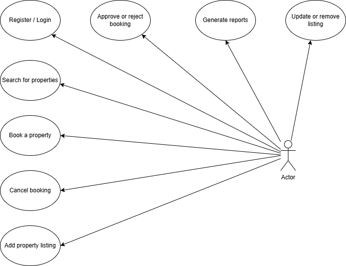

# 🧩 Requirement Analysis in Software Development

## 📘 Introduction
This repository serves as the foundation for the **Requirement Analysis Project**, which focuses on documenting, analyzing, and structuring software requirements for a **Booking Management System**.  

The goal of this project is to simulate a real-world software development scenario by performing detailed requirement analysis — a crucial phase of the **Software Development Life Cycle (SDLC)**.  

Through this project, learners will gain hands-on experience in gathering, defining, and documenting both **functional** and **non-functional** requirements, creating **use case diagrams**, and establishing **acceptance criteria** to ensure system clarity and alignment with business objectives.

## 🎯 Purpose of the Repository
This repository is created to:
- Serve as a workspace for documenting the **requirement analysis phase** of the booking management system.  
- Provide structured and professional documentation using **markdown files** and **visual diagrams**.  
- Demonstrate best practices in **requirement engineering**, **use case modeling**, and **acceptance criteria definition**.  
- Prepare learners for **real-world software planning** and **client documentation processes**.  

## 🧠 Learning Objectives
By completing this project, learners will be able to:
- Master the principles and methodologies of **Requirement Analysis** in the SDLC.  
- Translate project needs into well-structured documentation.  
- Identify and categorize **functional** and **non-functional** requirements.  
- Use **Draw.io** (or similar tools) to visually represent system requirements.  
- Define **acceptance criteria** to align development goals with user expectations.  
- Apply **industry-standard documentation** and best practices.  

## 🛠️ Requirements
To complete this project, ensure you have:
- A **GitHub account** with the ability to create repositories.  
- Knowledge of writing **markdown files** (README.md).  
- Understanding of the **SDLC** and the role of requirement analysis.  
- Experience using **Draw.io** (or equivalent) for creating system diagrams.  
- Access to the **Booking Management System case study** for reference.  

## 🌟 Key Highlights
- **Real-world Application:** Simulates practical software analysis and planning.  
- **Comprehensive Documentation:** Covers requirement gathering, categorization, and diagramming.  
- **Visual Representations:** Includes use case diagrams and actor interactions.  
- **Practical Insights:** Defines acceptance criteria and success metrics.  
- **Structured Learning Path:** Builds concepts step-by-step for clarity.  
- **Professional Standards:** Follows industry norms for requirement documentation.  

## 🧩 What is Requirement Analysis?
**Requirement Analysis** is a critical stage in the **Software Development Life Cycle (SDLC)** that focuses on understanding and documenting what a system should do. It involves gathering, analyzing, and validating user needs and business goals to create a clear, actionable foundation for design and development.

### 💡 Importance of Requirement Analysis in SDLC
1. **Clarity & Understanding:** Ensures a shared vision between developers, clients, and stakeholders.  
2. **Reduces Errors:** Identifies issues early, minimizing costly rework and misunderstandings.  
3. **Improves Planning:** Provides accurate information for estimating timelines, resources, and budgets.  
4. **Enhances Quality:** Leads to software that meets user expectations and business objectives.  
5. **Strengthens Communication:** Bridges the gap between technical and non-technical teams.  
6. **Supports Validation:** Defines measurable criteria for testing and verifying system functionality.

## 🔍 Why is Requirement Analysis Important?
Requirement Analysis is a **cornerstone of the Software Development Life Cycle (SDLC)**. It ensures that the final product aligns with both **business objectives** and **user expectations**. Without this phase, projects often suffer from miscommunication, scope creep, and costly rework.  

Here are three key reasons why Requirement Analysis is essential:

### 1. 🎯 Establishes Clear Project Direction
Requirement Analysis defines *what* needs to be built and *why*.  
By gathering and analyzing stakeholder needs, the development team gains a shared understanding of the project’s purpose, features, and constraints — eliminating ambiguity and ensuring everyone works toward the same goals.

### 2. 🧩 Reduces Risks and Prevents Rework
Properly documented requirements help identify potential issues early in the process.  
This minimizes the risk of misinterpretations, missed functionalities, and expensive redesigns later in the development phase. It ultimately saves time, money, and resources.

### 3. 🚀 Enhances Software Quality and User Satisfaction
When requirements are well-analyzed and validated, the resulting software meets user expectations more effectively.  
A clear understanding of functional and non-functional needs leads to systems that are more **usable**, **reliable**, and **maintainable**, increasing overall user satisfaction and system longevity.

## 🧠 Key Activities in Requirement Analysis
The **Requirement Analysis** phase involves a series of structured activities designed to ensure that the software being developed meets the needs and expectations of users and stakeholders.  
Below are the **five key activities** that form the backbone of this process:

### 1. 📋 Requirement Gathering
- Involves collecting initial information from stakeholders, clients, and end-users.  
- Helps identify business objectives, constraints, and high-level system expectations.  
- Techniques such as **interviews**, **questionnaires**, and **workshops** are often used.  
- The goal is to obtain a clear and complete list of what the system should achieve.

### 2. 🗣️ Requirement Elicitation
- Focuses on extracting detailed and precise requirements from stakeholders.  
- Encourages collaboration to understand the *why* behind each requirement.  
- Involves observing users, conducting brainstorming sessions, and studying existing systems.  
- Ensures that hidden, implicit, and conflicting needs are uncovered early.

### 3. 📝 Requirement Documentation
- Converts gathered and elicited information into a structured format for clarity and communication.  
- Common documents include the **Software Requirement Specification (SRS)**, **User Stories**, and **Use Case Diagrams**.  
- Well-documented requirements serve as a reference point for designers, developers, and testers.  
- Promotes transparency and ensures all stakeholders agree on project scope.

### 4. 🧩 Requirement Analysis and Modeling
- Involves breaking down and categorizing requirements into **functional** and **non-functional** groups.  
- Helps visualize system behavior and interactions using tools like **UML** and **Draw.io** diagrams.  
- Identifies dependencies, inconsistencies, and feasibility concerns.  
- Supports the creation of logical models that represent how the system will operate.

### 5. ✅ Requirement Validation
- Ensures the documented requirements accurately represent stakeholder needs and business goals.  
- Involves reviewing, prototyping, and performing walkthroughs to confirm completeness and correctness.  
- Detects gaps or ambiguities before design and development begin.  
- Validated requirements act as the **baseline** for all future stages of the SDLC.

## 🧾 Types of Requirements
In software engineering, requirements are broadly categorized into **Functional** and **Non-functional Requirements**.  
Both are essential in ensuring that the system operates effectively and meets stakeholder expectations.

### ⚙️ Functional Requirements
**Definition:**  
Functional requirements describe *what* the system should do — the specific behaviors, features, and operations that enable users to accomplish tasks.  
They define how the system responds to inputs, handles processes, and produces outputs.

**Examples for the Booking Management System:**
- 🏠 The system shall allow users to **browse and search available accommodations** by date, location, and price range.  
- 🧾 The system shall allow users to **make, modify, or cancel bookings** through their accounts.  
- 👤 The system shall allow users to **register and log in** using email and password.  
- 💳 The system shall enable **secure payment processing** through integrated payment gateways.  
- 📅 The system shall display **real-time room availability** and prevent double bookings.  
- 📧 The system shall send **email confirmations and reminders** to users after successful bookings.  
- 🧑‍💼 The system shall provide **administrators** with access to manage users, bookings, and property listings.

### 🧠 Non-functional Requirements
**Definition:**  
Non-functional requirements define *how* the system performs its functions rather than what it does.  
They describe system attributes such as performance, usability, reliability, and security — ensuring a high-quality user experience.

**Examples for the Booking Management System:**
- ⚡ **Performance:** The system should load search results within **3 seconds** under normal server load.  
- 🔐 **Security:** All sensitive data (e.g., user credentials and payment details) must be encrypted using **SSL/TLS protocols**.  
- 📱 **Usability:** The interface should be **responsive** and accessible on desktops, tablets, and mobile devices.  
- 🧩 **Scalability:** The system should support at least **10,000 concurrent users** without performance degradation.  
- 🧍 **Reliability:** The system should maintain **99.9% uptime** to ensure continuous service availability.  
- 💬 **Maintainability:** The system codebase should be modular and well-documented for easier updates and debugging.  
- 🌐 **Localization:** The application should support **multiple currencies and languages** for international users.

## 🧩 Use Case Diagrams

### What is a Use Case Diagram?
A **Use Case Diagram** is a visual representation of how users (known as *actors*) interact with a system. It shows the different functionalities or *use cases* that the system provides and the relationships between users and those functionalities.

Use case diagrams are commonly used during **Requirement Analysis** to capture the functional requirements of a system in a simple and easy-to-understand format.

### 🎯 Benefits of Use Case Diagrams
- **Clarity** – They provide a clear overview of system interactions from a user’s perspective.  
- **Communication Tool** – Help bridge the gap between technical and non-technical stakeholders.  
- **Requirement Validation** – Ensure all user needs and interactions are captured accurately.  
- **System Scope Definition** – Clearly outline what features are included in the system.  

### 🧠 Use Case Diagram for the Booking Management System

Below is the use case diagram that illustrates the interactions between users and the booking system.

#### 👥 **Actors:**
- **Guest** – Can browse listings, make bookings, and cancel bookings.  
- **Host** – Can list properties, manage listings, and confirm bookings.  
- **Admin** – Can manage users, view system reports, and handle disputes.  

#### ⚙️ **Use Cases:**
- Register / Login  
- Search for properties  
- Book a property  
- Cancel booking  
- Add property listing  
- Update or remove listing  
- Approve or reject booking  
- Generate reports

### 📊 Use Case Diagram

## ✅ Acceptance Criteria

### 📘 What is Acceptance Criteria?
**Acceptance Criteria** are predefined conditions or statements that must be met for a feature or functionality to be considered complete and accepted by the client or stakeholders.  
They help ensure that each system feature fulfills the requirements and performs as expected.

Acceptance criteria serve as a **bridge between requirements and testing**, allowing both developers and testers to verify that the delivered product meets user needs and aligns with business goals.

### 🎯 Importance of Acceptance Criteria
- **Ensures clarity** – Defines clear expectations for each feature before development begins.  
- **Reduces misunderstandings** – Aligns developers, testers, and stakeholders on the same page.  
- **Improves quality assurance** – Provides a reference for validating whether a feature works correctly.  
- **Supports user satisfaction** – Guarantees that the system delivers the intended user experience.  
- **Facilitates testing** – Enables QA teams to write effective test cases directly from the acceptance criteria.

### 💡 Example: Acceptance Criteria for the **Checkout Feature**
**Feature:** Checkout Process in the Booking Management System  

**Acceptance Criteria:**
1. The user must be able to review their selected property details before confirming the booking.  
2. The checkout page must display the total cost, including taxes and fees.  
3. Users must be able to input valid payment details (credit/debit card, PayPal, etc.).  
4. Upon successful payment, the system should generate a booking confirmation with a unique booking ID.  
5. If payment fails, the user should receive a clear error message and be prompted to retry.  
6. The booking confirmation email must be automatically sent to the user within one minute of successful checkout.  
